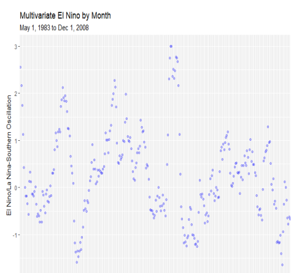
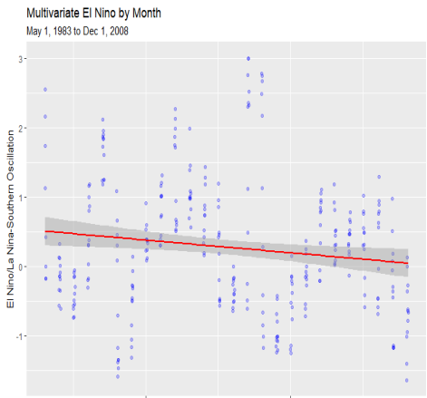

# Climate-Change-Metrics-Analysis
<header>
  <hi>Analysis of Climate Change Metrics using R</hi>
</header>
<section>
  <h1>
    El Nino For Example
  </h1>
  

    Because of seasonal variation (summer, winter, etc) several of these variables have obscured trends. It is obvious that dichlorodifluoromethane, Methane, Carbone Dioxide,and Nitrous Oxide are positively correlated to the increase of time.
 
  But what about something like El Nino which has a varying effect from year to year, and when measured doesn't obviously relate to a strict increase or decrease?
 
  
 
  Using linear regression it is revealed that some less obvious variables are positively
correlated to the passage of time. Including: Trichlorofluoromethan and temperature
measured in celsius compared to global averages.
  
 
  In this case using regression reveals that El Nino actually has a negative correlation to the passage of time, meaning that regular natural cycles of temperature extremes are actually having a decreasing effect on global temperature compared to other factors. 
  

</section>
<section>
  <h1>The Report</h1>
  
The Report can be found in the repository documents which covers a brief review of various climate change metrics. My analysis does not drill too deeply and only considers which metrics are overtly correlated to the passage of time and increase in temperature.
 
All of the regressions where calculated using the included dataset using the R statistical programming language in R-Studio which makes it a bit easier to use. 

</section>
